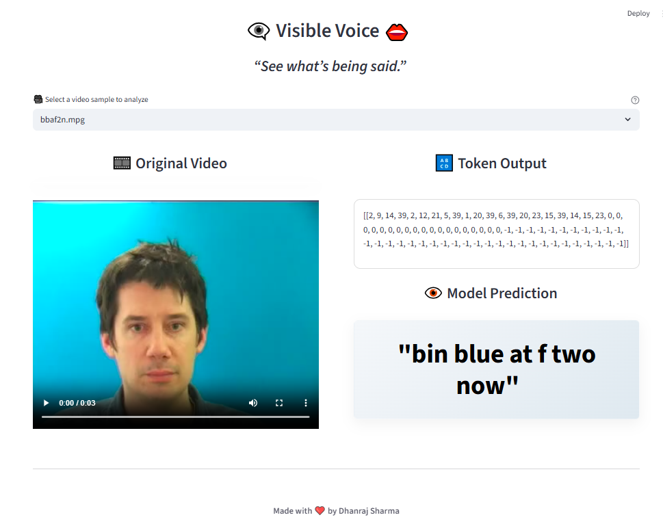

# 👄 Visible Voice – Lip Reading AI

> ***See what’s being said — even in silence.***  


### ⚠️ NOTE
This app is trained on controlled video datasets from **LipNet: End-to-End Sentence-level Lipreading** and is for **educational/demo use only**. It does not support real-time webcam input or noisy environments.


## 🎥 App Preview

<p align="center">
  
</p>

---

## 🎯 Project Overview

**Visible Voice** is a computer vision + deep learning application that performs **lip reading**—converting silent video of a person’s mouth into predicted text. It is ideal for assistive tech, silent communication, and low-audio environments.

> 🧠 Select a video of someone speaking from provided list. 
> 👄 Model reads their lips 
> 💬 Get back a sentence of what was said!

✅ Real video frames
✅ No audio required
✅ Modern deep learning model
✅ Interactive Streamlit app


## 📌 Workflow

- Load & preprocess video frames

- Normalize grayscale mouth regions

- Parse ground truth alignment tokens

- Tokenize text with character-level mapping

- Build deep 3D CNN + BiLSTM model

- Train on sentence alignment data

- Streamlit app for visual prediction & decoding

---

## 🧠 How It Works

1. **Video Preprocessing:** Extracts mouth-region grayscale frames from each video

2. **Text Alignment:** Loads phoneme-to-text mappings and converts to character tokens

3. **Model Architecture:**

    - 3D Convolutions to capture spatiotemporal features

    - Bi-LSTM to capture context across frames

    - CTC Loss to handle unaligned sequences

4. **Prediction Output:** Model predicts tokens, which are decoded back into text

---

## 🔍 Features

| Function               | Description                                          |
| ---------------------- | ---------------------------------------------------- |
| 🎥 Video Input         | Upload pre-recorded videos for lip analysis          |
| 🎞️ Frame Extraction   | Converts video to frame sequence of mouth region     |
| 🧠 Deep Neural Network | CNN + Bi-LSTM model for sequence-to-text prediction  |
| 🔡 Character Decoder   | Converts predicted tokens into readable text         |
| 🖥️ Clean Streamlit UI | Sleek web interface with prediction highlights       |
| 🔁 CTC Decoding        | Handles variable-length input/output alignment       |
| 📦 Pretrained Weights  | Model loads from saved checkpoints for quick testing |

---

## 🧪 Model Architecture

- **Conv3D Layers:** Capture spatial + temporal mouth movements

- **MaxPooling:** Reduces resolution while keeping features

- **TimeDistributed Flattening:** Prepares 3D frames for sequence modeling

- **Bidirectional LSTM:** Learns time-sequential speech patterns

- **Dense Softmax Output:** Character-level probability output

- **CTC Loss:** Enables training without frame-level text alignment


## 📦 Requirements

```txt
opencv-python==4.6.0.66
matplotlib==3.6.2
imageio==2.23.0
gdown==4.6.0
tensorflow==2.15.0
streamlit
etc
```

Install everything using:
```bash
pip install -r requirements.txt
```

You need to download **ffmpeg** also as to run videos and convert them to `.mp4`.
> Link : https://ffmpeg.org/download.html ( download according to your os )


## ⚙️ Getting Started

1️⃣ **Clone the repository**
```bash
git clone https://github.com/yourusername/Lip-Reading-AI.git
cd Lip-Reading-AI
```

2️⃣ **Download and prepare your dataset**
- Download dataset (e.g., GRID corpus or similar) or you can simply download it from given link

> Dataset : https://drive.google.com/uc?id=1YlvpDLix3S-U8fd-gqRwPcWXAXm8JwjL

- Place .mpg videos in: data/s1/

- Place .align label files in: data/alignments/s1/

3️⃣ **Train the Model (optional)**

You can either train your model and save it or else can use the `checkpoint.zip` to load and use model.
```
Run: LipNet_Refined.ipynb
```
Will generate weights and store them in`/models/checkpoint`

4️⃣ **Run the Streamlit App**
```bash
cd app
streamlit run app.py
```

5️⃣ **Use the App**

- Select a video from list and see the magic!

- View token and predicted sentence ; also can confirm that by playing the video .


## ✨ Highlights

- ✅ End-to-end lip reading from video

- ✅ Uses real alignment data

- ✅ Clean & informative UI

- ✅ Model accuracy viewable via token prediction

- ✅ Easily extendable to real-time or audio-paired models


## 🔮 Future Improvements
- 🧑‍💻 Real-time webcam lip reading

- 🧠 Transformer-based models (e.g., Lipformer)

- 🗣️ Audio-visual fusion models

- 🌐 Multilingual lip reading

- 📱 Responsive mobile interface


## 📊 Sample Output

| Video File   | Predicted Sentence           | Accuracy (Est.) |
| ------------ | ---------------------------- | --------------- |
| `bbaf2n.mpg` | “bin blue at f two now”      | 100%             |
| `bbbm1s.mpg` | “bin blue by m one soon” | 100%             |


### 🧠 Powered by:

- TensorFlow / Keras

- OpenCV

- Streamlit

- NumPy

- ImageIO

- GDown


## 📜 License

Licensed under the [MIT License](LICENSE).


> **Visible Voice** — *Empowering speech through vision.*

> ❤️ Made with love by **Dhanraj Sharma**.
